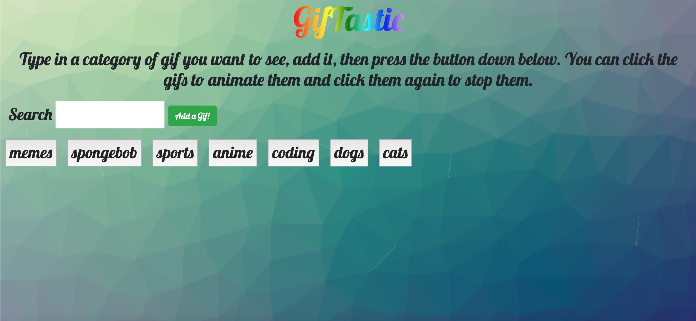
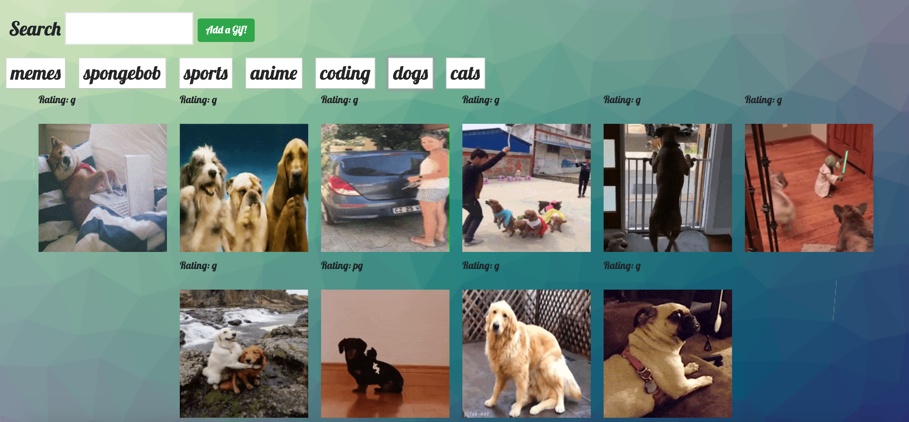

# GifTastic

## Site Pictures

## Technologies Used
- HTML 
- CSS
- Git
- GitHub
- Javascript
- jQuery
- AJAX

## Summary

GifTastic is a web application where the user can search up gifs pulled from the Giphy API. Typing into the search bar and pressing the add a gif button will create a new button on the page that will display 10 gifs of that particular search content. Once the 10 gifs are loaded and appended to the page the user can then click on each one to animate the gif and click them again to stop.

### Links
- [GifTastic](https://jerry-dudum.github.io/GifTastic/)
- [LinkedIn](https://www.linkedin.com/in/jsdudum/)